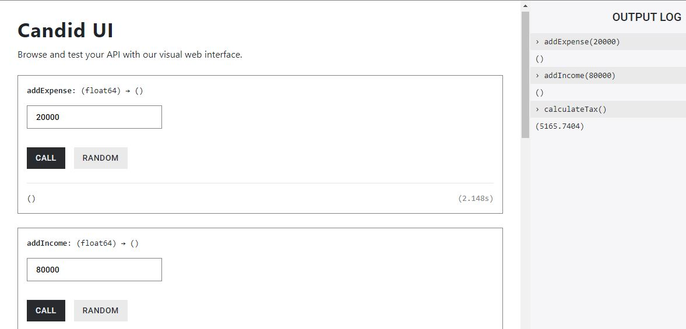

# A Motoko prototype for calculating taxes
## Purpose
In the way of learning about Internet Computer Protocol and Motoko, I decided to create this prototype that is likely to help more than one person. This is a tax calculator for natural persons in Mexico that decided to pay taxes through the Bussiness Activity tax regime. We have to do monthly calculations to determine the amount of taxes on our incomes. The prototype considers only May 2023 as shown below:

**Tax = (Net Income - Lower limit) * Rate + Fixed Fee**

|Lower limit|Higher limit|Fixed fee|% of income minus lower|
| ------------ | ------------ | ------------ | ------------ |
|0.01 | 3,730.20 | 0 | 1.92|
|3730.21 | 31,660.25 | 71.6 | 6.4|
|31660.26 | 55,640.05 | 1859.15 | 10.88|
|55640.06 | 64,679.10 | 4468.15 | 16|
|64679.11 | 77,438.55 | 5914.4 | 17.92|
|77438.56 | 156,182.45 | 8200.9 | 21.36|
|156182.46 | 246,165.00 | 25020.6 | 23.52|
|246165.01 | 469,969.50 | 46184.45 | 30|
|469969.51 | 626,626.00 | 113325.85 | 32|
|626626.01 | 1,879,878.05 | 163455.9 | 34|
|1879878.06 | En adelante | 589561.6 | 35|

For example, for a net income of 60,000 MXN, the calculations will be like this:

- **Tax = (60,000 - 55640.06) * 0.16 + 4468.15**
- **Tax = 4,359.94 * 0.16 + 4468.15**
- **Tax = 697.5904 + 4468.15**
- **Tax = 5,165.7404**

## Usage
This application provides the following methods:
- addExpense(sub : Float): accumulates the subtotal of one invoice related to an expense.
- addIncome(sub : Float): accumulates the subtotal of one invoice related to an income.
- calculateTax(): performs the necessary calculations to determine the tax to pay.
- netIncome(): subtraction of the total of expenses from the total of incomes.
- resetExpenses(): sets the accumulated expenses to zero.
- resetIncomes(): sets the accumulated incomes to zero.
- totalExpenses(): shows the accumulated expenses.
- totalIncomes(): shows the accumulated incomes.

## Deploy
It is required a machine running a Linux distro (this was tested in Ubuntu 22.04.2 LTS). For Microsoft Windows users (fully updated 10 and 11), WSL could be helpful.